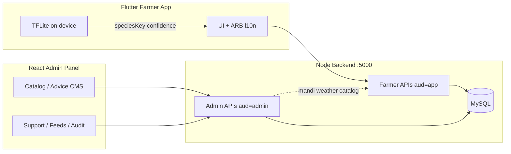
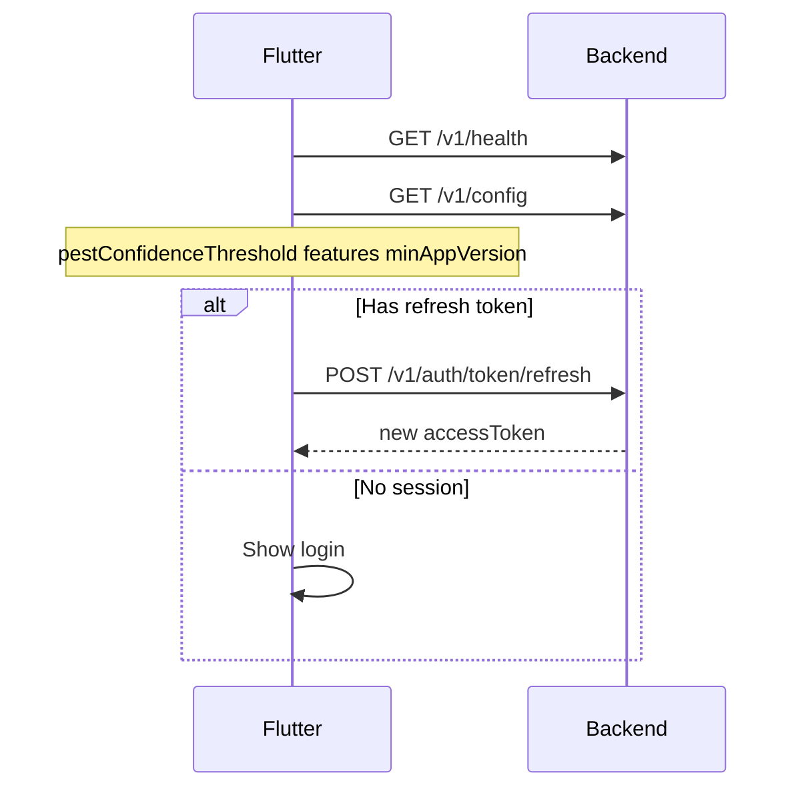
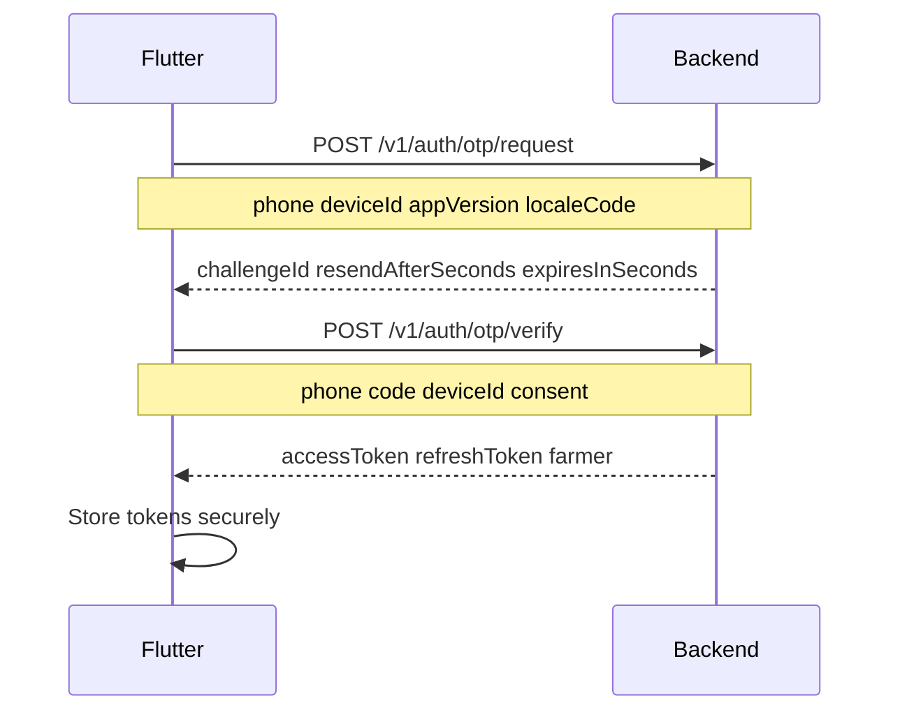
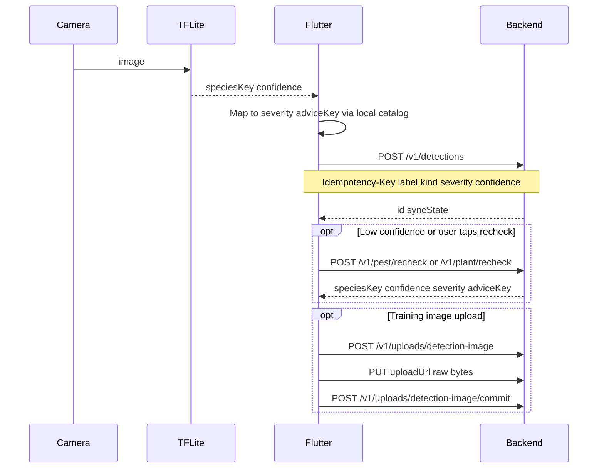
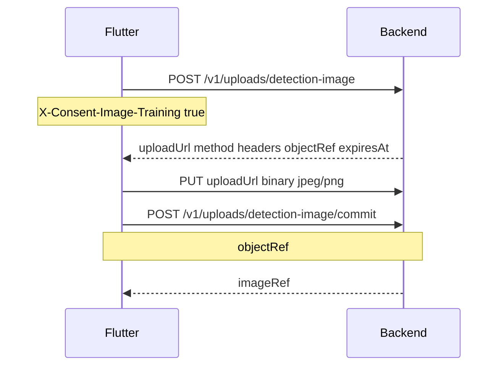
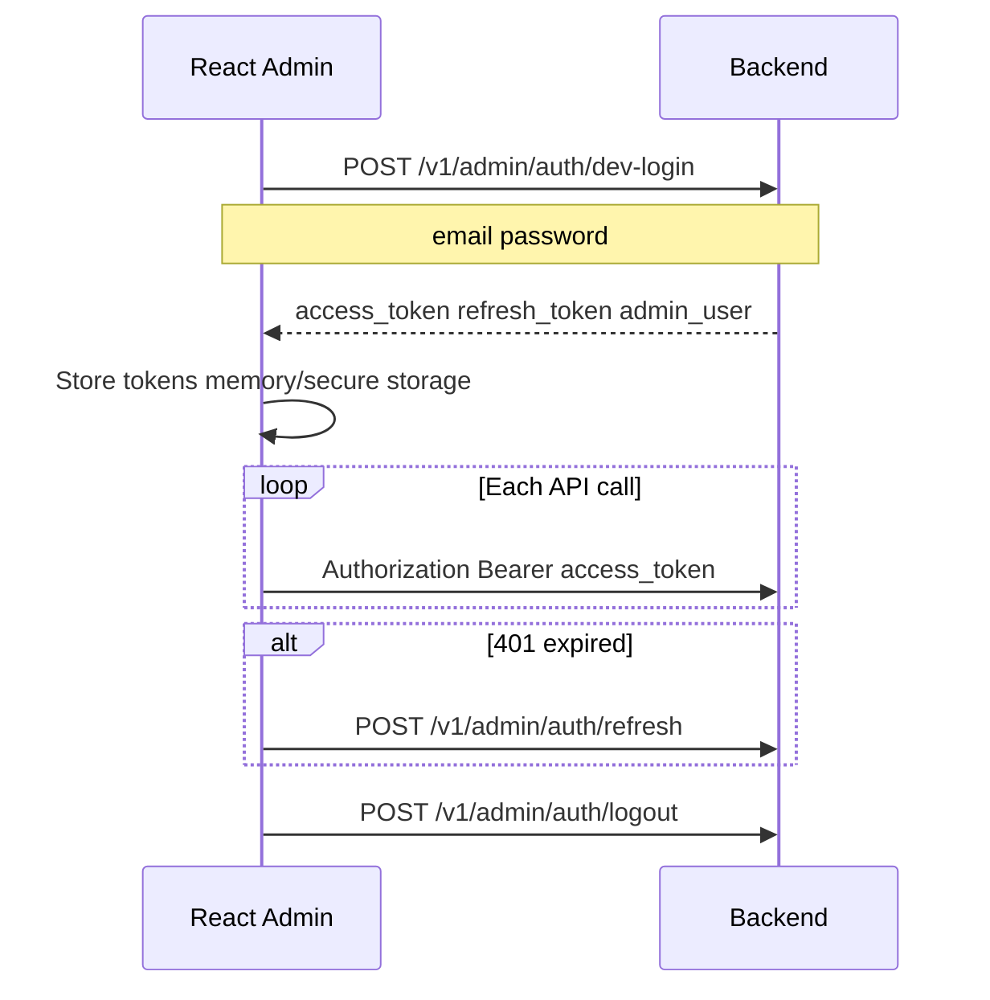
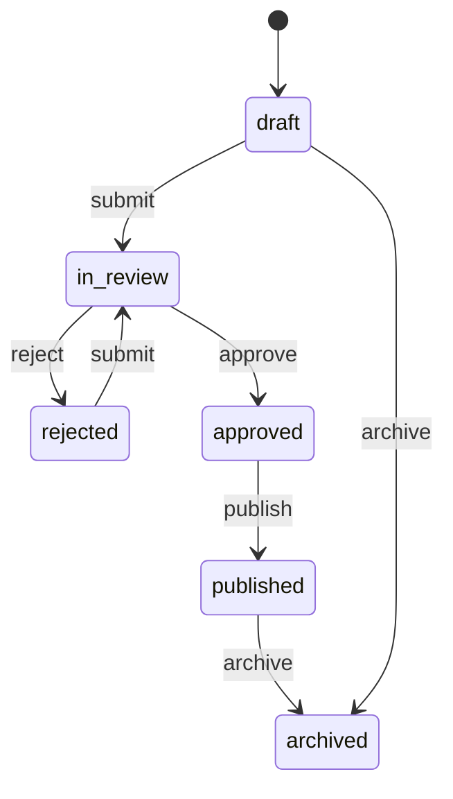

# Aasan Kisan — Frontend Integration Guide

**Audience:** Flutter farmer app team + React admin panel team  
**Backend base URL (dev):** `http://localhost:5000`  
**API prefix:** `/v1`  
**Machine-readable catalog:** `API_REFERENCE.json`  
**Admin product spec:** `ADMIN_PANEL_WEB_AND_DB.md`

This document explains **every implemented backend flow**, how the two frontends connect, and what each screen/module should call. Nothing in the farmer app talks to admin routes, and admin JWTs are rejected on farmer routes.

---

## 1. Two frontends, one backend

| Client | Stack | Auth | Base paths |
|--------|-------|------|------------|
| **Farmer app** | Flutter | Phone OTP → JWT `aud=app` | `/v1/auth/*`, `/v1/farmers/*`, `/v1/detections/*`, … |
| **Admin panel** | React | Email/password (dev) → JWT `aud=admin` | `/v1/admin/*` only |



**Golden rule:** The app never shows free-text advice from the API. Backend returns **keys** (`speciesKey`, `adviceKey`, `l10nLabelKey`, `conditionKey`, …). Flutter resolves them via bundled ARB files. Admin CMS edits those keys/translations for future app releases.

---

## 2. Common HTTP contract

### 2.1 Success envelope (most farmer + admin read/write)

```json
{
  "data": { },
  "meta": {
    "requestId": "req_abc123",
    "serverTime": "2026-06-25T09:14:02.512Z",
    "localeServed": "ur"
  }
}
```

**Exceptions (raw JSON, no `data` wrapper):**

| Endpoint | Shape |
|----------|--------|
| `POST /v1/auth/otp/request` | OTP challenge fields directly |
| `POST /v1/auth/otp/verify` | `{ accessToken, refreshToken, farmer, ... }` |
| `POST /v1/admin/auth/dev-login` | `{ access_token, refresh_token, expires_in, admin_user }` |
| `POST /v1/admin/auth/refresh` | `{ access_token, refresh_token, expires_in }` |
| `POST /v1/admin/auth/stepup` | `{ stepup_token, expires_in }` |
| `POST /v1/admin/mandi/refresh` | `{ job_id }` (202) |
| `POST /v1/admin/weather/refresh` | `{ job_id }` (202) |
| `POST /v1/sync/batch` | 207 `{ data: { pushResults, pull } }` |
| `GET /v1/identity/status` | `{ status, maskedCnic, verifiedAt }` |
| `POST /v1/identity/cnic/verify` | `{ status, maskedCnic, verifiedAt }` |

### 2.2 Error envelope

```json
{
  "error": {
    "code": "not_found",
    "detail": "Human-readable (dev/logs)",
    "field": null,
    "retryable": false,
    "requestId": "req_..."
  },
  "meta": { "requestId": "...", "serverTime": "..." }
}
```

### 2.3 Headers

#### Farmer app (authenticated)

| Header | Required | Purpose |
|--------|----------|---------|
| `Authorization` | Yes* | `Bearer <accessToken>` (`aud=app`) |
| `X-Request-Id` | Recommended | UUID v4 per request |
| `Accept-Language` | Recommended | `ur`, `en`, `pa`, `skr` |
| `X-Device-Locale` | Recommended | Device UI locale |
| `X-App-Version` | Recommended | e.g. `1.0.0+1` |
| `X-Device-Id` | Recommended | Stable device id |
| `X-Consent-Analytics` | Recommended | `true` / `false` |
| `X-Consent-Image-Training` | For training upload | `true` / `false` |
| `Idempotency-Key` | **Mutations** | Unique per mutation (see §2.4) |

\*Not required on public routes (§2.5).

#### Admin panel (authenticated)

| Header | Required | Purpose |
|--------|----------|---------|
| `Authorization` | Yes | `Bearer <access_token>` (`aud=admin`) |
| `If-Match` | Advice PATCH | Advice `version` number |
| `X-Access-Reason` | PII views | Reason string when viewing full phone (support) |
| `Idempotency-Key` | Optional | Advice `POST` (recommended) |

**Never send admin token to farmer endpoints** — response: `401` “Admin token not valid for farmer API”.

### 2.4 Idempotency (farmer mutations)

Required on:

- `POST /v1/detections`
- `POST /v1/sync/detections`
- `PATCH /v1/farmers/me`
- `POST /v1/farmers/:farmerId/plots`
- `PUT|PATCH|DELETE /v1/plots/:plotId`
- `PUT /v1/me/consent`

Same key + same body → replay cached response. Same key + different body → `409 idempotency_key_reuse`.

### 2.5 Public routes (no farmer token)

- `GET /v1/health`, `GET /api/health`
- `GET /v1/config`
- `POST /v1/auth/otp/request`, `POST /v1/auth/otp/verify`, `POST /v1/auth/token/refresh`
- `POST /v1/admin/auth/dev-login`, `POST /v1/admin/auth/sso/callback`, `POST /v1/admin/auth/refresh`
- `GET /.well-known/jwks.json`

---

## 3. Dev credentials & setup

```bash
npm run db:migrate   # migrations 001–006 (admin + phase 2 tables)
npm run dev          # http://localhost:5000
```

| Purpose | Value |
|---------|--------|
| Farmer OTP (all phones) | `123456` |
| Admin email | `admin@aasan.kisan` |
| Admin password | `admin123` |
| Admin role (seed) | `super_admin` |

Env overrides: `DEV_OTP_CODE`, `DEV_ADMIN_EMAIL`, `DEV_ADMIN_PASSWORD`, `BASE_URL`, `JWT_SECRET`.

---

## 4. Flutter farmer app — flows

### 4.1 App cold start



**`GET /v1/config`** → use `pestConfidenceThreshold` (default `0.55`) to decide cloud recheck UX; `features.plantRecheck`, `features.advisory`, etc.

**Optional:** `GET /v1/models/manifest`, `GET /v1/labelmap/pest|plant` for model download / label index (stubs point to `/uploads/models/*.tflite`).

---

### 4.2 Login (OTP)



| Step | Method | Path | Body highlights |
|------|--------|------|-----------------|
| 1 | POST | `/v1/auth/otp/request` | `phone`, `deviceId`, `appVersion`, `localeCode` |
| 2 | POST | `/v1/auth/otp/verify` | `phone`, `code`, `deviceId`, `consent: { analytics, imageTraining }` |

**After login:** New farmers get seed plots in DB. Token payload: `sub=farmerId`, `role=farmer`, `did=deviceId`, `aud=app`.

**Session maintenance:**

| Action | Endpoint |
|--------|----------|
| Refresh | `POST /v1/auth/token/refresh` `{ refreshToken }` |
| Logout | `POST /v1/auth/logout` |
| List sessions | `GET /v1/auth/sessions` |
| Delete account | `DELETE /v1/auth/account` |

---

### 4.3 Profile & plots

| Screen / action | Method | Path | Notes |
|-----------------|--------|------|-------|
| Home / profile | GET | `/v1/farmers/me` | Farmer profile + consent |
| Edit name/district/locale | PATCH | `/v1/farmers/me` | `Idempotency-Key` |
| List plots | GET | `/v1/farmers/{farmerId}/plots` | `farmerId` must match token |
| Create plot | POST | `/v1/farmers/{farmerId}/plots` | `Idempotency-Key` |
| Plot detail | GET | `/v1/plots/{plotId}` | |
| Update plot | PUT or PATCH | `/v1/plots/{plotId}` | `Idempotency-Key` |
| Delete plot | DELETE | `/v1/plots/{plotId}` | Soft delete |

**Consent (GDPR-style):**

| Action | Endpoint |
|--------|----------|
| Update consent | `PUT /v1/me/consent` + `Idempotency-Key` |
| Export data | `GET /v1/me/export` |
| Delete me | `DELETE /v1/me` |

---

### 4.4 Pest / plant scan (core — on-device ML)

**Important:** Image classification runs **on the phone** (TFLite). The backend does **not** analyze images for species. It only **stores** the result the app sends.



#### Save detection

`POST /v1/detections` — **requires `Idempotency-Key`**

```json
{
  "id": "client-uuid",
  "plotId": "optional-plot-uuid",
  "kind": "pest",
  "label": "aphids",
  "severity": "medium",
  "confidence": 0.87,
  "adviceKey": "aphids",
  "source": "onDevice",
  "modelVersion": "assan_pest_v1",
  "createdAt": "2026-06-25T09:00:00.000Z",
  "imageRef": null
}
```

| Field | Rules |
|-------|--------|
| `kind` | `pest` \| `disease` (plant nutrient findings use `disease`) |
| `label` / `speciesKey` | Must exist in server catalog (see §7) |
| `severity` | `low` \| `medium` \| `high` \| `critical` |
| `confidence` | `0.0` – `1.0` |
| `id` | Client-generated UUID; duplicate POST returns `200` synced (idempotent) |

**List / detail:**

- `GET /v1/detections?limit=20`
- `GET /v1/detections/{id}`

Response fields: `speciesKey`, `severity`, `confidence`, `adviceKey`, `syncState`, `revision`.

#### Cloud recheck (server stub)

When on-device confidence &lt; threshold from `/v1/config`:

| Kind | POST | Body |
|------|------|------|
| Pest | `/v1/pest/recheck` | `{ onDeviceTopK: [{ speciesKey, confidence }], cropKey? }` |
| Plant | `/v1/plant/recheck` | Same shape; plant species keys |

Server returns refined `speciesKey`, `confidence`, `severity`, `adviceKey` (stub logic today).

---

### 4.5 Offline sync

For outbox / background sync:

| Endpoint | Purpose |
|----------|---------|
| `POST /v1/sync/detections` | Same as single detection create |
| `POST /v1/sync/batch` | Push array + optional pull |

**Batch body:**

```json
{
  "push": [
    { "outboxId": "local-1", "body": { /* detection fields */ } }
  ],
  "pull": { "limit": 50 }
}
```

**Response:** HTTP `207` with `pushResults[]` per item (`applied` \| `duplicate` \| `rejected`) and `pull.changes[]` for server-side updates.

---

### 4.6 Training image upload (optional)

Only if `imageTraining` consent is true (login consent or `PUT /v1/me/consent`).



1. `POST /v1/uploads/detection-image` — `{ detectionId, contentType, byteSize, sha256 }`
2. `PUT {uploadUrl}` — raw file, `Content-Type: image/jpeg` or `image/png` (max 5 MB)
3. `POST /v1/uploads/detection-image/commit` — `{ objectRef }`
4. Store returned `imageRef` on future detections if needed.

Committed files served at `GET /v1/files/detection-images/{filename}`.

---

### 4.7 Mandi prices

Admin-edited prices flow to the farmer app automatically.

| Screen | Method | Path |
|--------|--------|------|
| Price list (home cards) | GET | `/v1/mandi/prices` |
| Crop detail + history | GET | `/v1/mandi/prices/{cropKey}` |
| Districts | GET | `/v1/mandi/districts` |
| Mandis | GET | `/v1/mandi/mandis?district=` |
| Commodities | GET | `/v1/mandi/commodities` |
| Search | GET | `/v1/mandi/search?q=` |

**Response shape (list):** `{ key, name: {en, ur}, pricePerMaund, changePct }`  
**`changePct`:** whole percent (e.g. `4.2` = +4.2%), not ratio.

**Crop keys:** `wheat`, `cotton`, `rice`, `sugarcane`, `maize`.

---

### 4.8 Weather

| Screen | Method | Path |
|--------|--------|------|
| Forecast | GET | `/v1/weather/forecast?district=Multan` |
| Sowing windows | GET | `/v1/weather/sowing` |
| Warnings | GET | `/v1/weather/warnings` |

Forecast uses `weather_feed` table when admin has edited; otherwise defaults for district. Keys like `conditionKey`, `warning.kind` → localize in ARB.

---

### 4.9 Identity & schemes (CNIC)

| Step | Method | Path |
|------|--------|------|
| Status | GET | `/v1/identity/status?farmerId=` |
| Verify CNIC | POST | `/v1/identity/cnic/verify` |

Body: `{ cnic, farmerId, consentToNadra: true }` — stub verification (no real NADRA call).

**Eligibility** (requires verified identity middleware):

- `GET /v1/eligibility`
- `GET /v1/eligibility/{scheme}` — `pmKisan`, `kissanCard`

---

### 4.10 AI advisory & voice (stubs)

| Feature | Method | Path |
|---------|--------|------|
| Model manifest | GET | `/v1/models/manifest` |
| Label map | GET | `/v1/labelmap/{pest\|plant\|crop}` |
| Ask advisory | POST | `/v1/advisory/ask` `{ question, locale }` → returns `answer` key |
| Feedback | POST | `/v1/advisory/feedback` |
| STT | POST | `/v1/voice/stt` |
| Voice intent | POST | `/v1/voice/intent` |

Answers are **keys**, not prose. Full RAG/ML ops is Phase 3 (`/v1/ai/*` not implemented).

---

### 4.11 Reference & geo

| Data | Endpoint |
|------|----------|
| Districts | `GET /v1/ref/districts` |
| Crops | `GET /v1/ref/crops` |
| Geo districts | `GET /v1/geo/districts` |
| District by GPS | `GET /v1/geo/district?lat=&lng=` |

---

### 4.12 Hotline & telemetry

| Feature | Endpoint |
|---------|----------|
| Helpline numbers | `GET /v1/hotline/contacts` → `labelKey` for ARB |
| Analytics batch | `POST /v1/telemetry/batch` (if consent) |

---

### 4.13 Flutter screen → API map (quick reference)

| App area | Primary APIs |
|----------|----------------|
| Splash / force update | `/v1/health`, `/v1/config` |
| Login | `/v1/auth/otp/*` |
| Dashboard | `/v1/farmers/me`, `/v1/mandi/prices`, `/v1/weather/forecast` |
| Plots | `/v1/farmers/{id}/plots`, `/v1/plots/*` |
| Pest scan | TFLite local → `/v1/detections`, `/v1/pest/recheck` |
| Plant scan | TFLite local → `/v1/detections`, `/v1/plant/recheck` |
| History | `/v1/detections` |
| Mandi | `/v1/mandi/*` |
| Weather | `/v1/weather/*` |
| Schemes | `/v1/identity/*`, `/v1/eligibility/*` |
| Settings / privacy | `/v1/me/consent`, `/v1/me/export`, `/v1/me` DELETE |
| Voice / chat | `/v1/voice/*`, `/v1/advisory/*` |

---

## 5. React admin panel — flows

### 5.1 Auth & session



| Action | Method | Path | Body / response |
|--------|--------|------|-----------------|
| Dev login | POST | `/v1/admin/auth/dev-login` | `{ email, password }` → `access_token`, `refresh_token`, `admin_user.grants[]` |
| SSO (prod) | POST | `/v1/admin/auth/sso/callback` | **501** — not wired (NADRA IdP Phase 3) |
| Refresh | POST | `/v1/admin/auth/refresh` | `{ refresh_token }` |
| Step-up MFA | POST | `/v1/admin/auth/stepup` | `{ password }` or `{ code }` → `stepup_token` (5 min) |
| Logout | POST | `/v1/admin/auth/logout` | 204 |

**`admin_user.grants`:** `[{ role, scope }]` — use for UI menu gating (server still enforces).

**Token TTL:** access ~15 min (`ADMIN_ACCESS_TOKEN_TTL_SEC`), refresh ~12 h.

**Step-up note:** Sensitive permissions (`models.set_threshold`, `l10n.toggle_locale`, PII, user admin, …) require `stepup: true` in the JWT claim. MVP step-up returns `stepup_token` but does not yet exchange it for a new access token — if you hit `403 stepup_required`, coordinate with backend or use non-step-up roles for dev. Production will wire TOTP/WebAuthn per `ADMIN_PANEL_WEB_AND_DB.md`.

---

### 5.2 RBAC — hide menus by permission

Check `admin_user.grants[].role` and/or call `GET /v1/admin/roles`. Server returns `403 FORBIDDEN` if permission missing.

| Role | Typical UI modules |
|------|-------------------|
| `super_admin` | Everything |
| `ops_officer` | Farmers (read), sync health, mandi/weather read+refresh, cloud recheck read, audit read |
| `agronomist` | Catalog, advice CMS (edit/approve/publish), cloud recheck review, detections |
| `content_manager` | Advice edit/publish, l10n strings/locales, catalog read |
| `support` | Farmers, OTP resend, DSR, PII (with reason) |
| `auditor` | Read-only audit, farmers, feeds, catalog |

Full permission matrix: `server/utils/adminRbac.js` and `ADMIN_PANEL_WEB_AND_DB.md` §B.4.

**UI pattern:**

```ts
// Pseudocode
const perms = derivePermissions(adminUser.grants);
if (!perms.has('advice_content.edit')) hideRoute('/advice/new');
```

---

### 5.3 Module: Admin users

| Action | Method | Path | Permission |
|--------|--------|------|------------|
| List roles | GET | `/v1/admin/roles` | `roles.read` |
| List users | GET | `/v1/admin/users` | `admin_users.read` |
| Create user | POST | `/v1/admin/users` | `admin_users.create` |
| Assign roles | PUT | `/v1/admin/users/{id}/grants` | `admin_users.assign_role` |
| Deactivate | POST | `/v1/admin/users/{id}/deactivate` | `admin_users.deactivate` |

---

### 5.4 Module: Farmer support

| Action | Method | Path | Permission |
|--------|--------|------|------------|
| Search farmers | GET | `/v1/admin/farmers?phone=&district=&page=&page_size=` | `farmers.read_list` |
| Farmer detail | GET | `/v1/admin/farmers/{id}` | `farmers.read_single` |
| Full phone (PII) | GET same + header `X-Access-Reason: ticket-123` | `farmers.read_pii` + step-up |
| Resend OTP | POST | `/v1/admin/farmers/{id}/resend-otp` | `otp.resend` |
| File DSR | POST | `/v1/admin/farmers/{id}/dsr` | `farmers.dsr_file` |
| DSR status | GET | `/v1/admin/dsr/{request_id}` | `farmers.dsr_file` |

List returns `phone_masked`, `plot_count`, `detection_count`, `consent`.

---

### 5.5 Module: Detections & cloud recheck

| Action | Method | Path | Permission |
|--------|--------|------|------------|
| All detections | GET | `/v1/admin/detections` | `detections.read` |
| Recheck queue | GET | `/v1/admin/cloud-recheck?status=pending` | `cloud_recheck.read` |
| Review item | POST | `/v1/admin/cloud-recheck/{id}/review` | `cloud_recheck.review` |
| Pest threshold | PUT | `/v1/admin/config/pest-threshold` | `models.set_threshold` |

**Review body:**

```json
{
  "verdict": "confirm",
  "species_key": "whitefly",
  "note_key": "optional_l10n_key"
}
```

`verdict`: `confirm` | `reclassify` (requires valid `species_key`).

Queue filters low-confidence pest detections (`confidence < 0.60`). `image_ref` only if farmer gave `imageTraining` consent.

---

### 5.6 Module: Catalog (species & severity)

| Action | Method | Path | Permission |
|--------|--------|------|------------|
| Pest catalog | GET | `/v1/admin/catalog/pest` | `catalog.read` |
| Plant catalog | GET | `/v1/admin/catalog/plant` | `catalog.read` |
| Edit severity | PUT | `/v1/admin/catalog/{kind}/{key}/severity` | `catalog.edit_severity` |

**Plant catalog response:** `{ diseases: [...], nutrients: [...] }`  
**Severity body:** `{ severity, version }` — optimistic locking; `409` on stale `version`.

Changes affect **new** farmer detections validation (`catalogService` cache refreshes on server start).

---

### 5.7 Module: Advice CMS (workflow)



| Action | Method | Path | Permission |
|--------|--------|------|------------|
| List | GET | `/v1/admin/advice?status=&kind=&speciesKey=&locale=` | `advice_content.read` |
| Create | POST | `/v1/admin/advice` | `advice_content.edit` |
| Edit | PATCH | `/v1/admin/advice/{id}` | `advice_content.edit` |
| Submit | POST | `/v1/admin/advice/{id}/submit` | `advice_content.edit` |
| Approve | POST | `/v1/admin/advice/{id}/approve` | `advice_content.approve` |
| Reject | POST | `/v1/admin/advice/{id}/reject` | `advice_content.approve` |
| Publish | POST | `/v1/admin/advice/{id}/publish` | `advice_content.publish` |
| Archive | POST | `/v1/admin/advice/{id}/archive` | `advice_content.edit` |
| History | GET | `/v1/admin/advice/{id}/history` | `advice_content.read` |
| New release | POST | `/v1/admin/content-releases` | `advice_content.publish` |
| Export ARB | GET | `/v1/admin/content-releases/{contentVersion}/arb` | `advice_content.read` |

**Create body:**

```json
{
  "speciesKey": "aphids",
  "kind": "pest",
  "l10nLabelKey": "pestLabelAphids",
  "l10nAdviceKey": "pestAdviceAphids",
  "translations": [
    { "locale": "ur", "labelText": "...", "adviceText": "...", "translationState": "machine_draft" }
  ]
}
```

**Rules for UI:**

- `speciesKey` must exist in catalog (except `kind: general`).
- Duplicate active `(speciesKey, kind)` → `409`.
- PATCH only when `status` is `draft` or `rejected`; send `If-Match: {version}`.
- **Separation of duties:** author cannot approve own entry; approver cannot publish own approval → `403 sod_violation`.
- **Publish** writes translations into `l10n_strings` for Flutter ARB export.

**Release flow:** Publish entries → `POST /content-releases` → download ARB → ship with Flutter app release.

---

### 5.8 Module: Mandi feed editor

| Action | Method | Path | Permission |
|--------|--------|------|------------|
| List rows | GET | `/v1/admin/mandi?crop=wheat&mandi=Multan` | `mandi_feed.read` |
| Edit price | PUT | `/v1/admin/mandi/{crop}/{mandi}` | `mandi_feed.edit` |
| Refresh job | POST | `/v1/admin/mandi/refresh?scope=wheat` | `mandi_feed.refresh` |

**PUT body:** `{ price_per_maund, change_pct, version }`  
Farmer app reads via `GET /v1/mandi/prices` — no extra publish step.

---

### 5.9 Module: Weather feed editor

| Action | Method | Path | Permission |
|--------|--------|------|------------|
| Get district feed | GET | `/v1/admin/weather?district=Multan` | `weather_feed.read` |
| Update | PUT | `/v1/admin/weather/{district}` | `weather_feed.edit` |
| Refresh job | POST | `/v1/admin/weather/refresh?district=Multan` | `weather_feed.refresh` |

**PUT body:**

```json
{
  "version": 1,
  "payload": {
    "currentTemp": 32,
    "feelsLike": 34,
    "condition": "clear",
    "warning": "frost"
  }
}
```

`warning`: `frost` | `null`. Farmer forecast: `GET /v1/weather/forecast?district=Multan`.

---

### 5.10 Module: Localization (l10n)

| Action | Method | Path | Permission |
|--------|--------|------|------------|
| Locales | GET | `/v1/admin/locales` | `l10n.read` |
| Toggle locale | PUT | `/v1/admin/locales/{code}` | `l10n.toggle_locale` |
| Strings | GET | `/v1/admin/strings?locale=ur&prefix=pest` | `l10n.read` |
| Edit string | PUT | `/v1/admin/strings/{locale}/{key}` | `l10n.edit` |
| Approve advice string | POST | `/v1/admin/strings/{locale}/{key}/approve` | `advice_content.approve` |

**Locale PUT:** `{ translated: true, version }` — when `translated` becomes true, locale appears in farmer app picker.

**String PUT:** Advice-related keys (`*Advice*`) return `202 pending_approval` until agronomist approves.

---

### 5.11 Module: Sync health & audit

| Action | Method | Path | Permission |
|--------|--------|------|------------|
| Sync metrics | GET | `/v1/admin/sync/health` | `sync.read` |
| Audit log | GET | `/v1/admin/audit` | `audit.read` |
| Verify chain | GET | `/v1/admin/audit/verify` | `audit.read` |
| Audit entry | GET | `/v1/admin/audit/{id}` | `audit.read` |

Wire critical mutations to show `meta.requestId` in support tickets.

---

### 5.12 React route → API map (suggested)

| Admin route (suggested) | APIs |
|-------------------------|------|
| `/login` | `POST /v1/admin/auth/dev-login` |
| `/dashboard` | sync health, audit summary |
| `/farmers` | `GET /v1/admin/farmers` |
| `/farmers/:id` | `GET /v1/admin/farmers/:id`, resend OTP, DSR |
| `/cloud-recheck` | `GET /v1/admin/cloud-recheck`, review POST |
| `/catalog` | `GET /v1/admin/catalog/pest`, `.../plant` |
| `/catalog/:key` | `PUT .../severity` |
| `/advice` | `GET/POST /v1/admin/advice` |
| `/advice/:id` | PATCH, submit/approve/reject/publish, history |
| `/releases` | content-releases + ARB download |
| `/mandi` | admin mandi GET/PUT/refresh |
| `/weather` | admin weather GET/PUT/refresh |
| `/l10n/locales` | locales GET/PUT |
| `/l10n/strings` | strings GET/PUT/approve |
| `/users` | admin users CRUD |
| `/audit` | audit GET |
| `/settings/threshold` | `PUT /v1/admin/config/pest-threshold` |

---

## 6. Catalog keys (contract)

### Pest (`kind: pest`)

| speciesKey | Default severity |
|------------|------------------|
| aphids | medium |
| whitefly | high |
| leafMiner | medium |
| bollworm | critical |
| healthy | low |

### Plant disease (`kind: disease`)

| speciesKey | Default severity |
|------------|------------------|
| leafRust | high |
| blight | critical |
| powderyMildew | medium |

### Plant nutrient (stored as `disease` kind in detections)

| speciesKey | Default severity |
|------------|------------------|
| nitrogenDeficiency | medium |
| potassiumDeficiency | high |

### Crops

`wheat`, `cotton`, `rice`, `sugarcane`, `maize` — names `{ en, ur }`.

### Locales (MVP)

`ur`, `pa`, `skr`, `en` (+ others in `locale_config`; only `translated: true` are selectable in app).

---

## 7. CORS & static files

- CORS is open in dev (`cors()`).
- Uploaded images: `/v1/files/detection-images/*`
- Model stubs: `/uploads/models/*` (if present)

React admin dev server: proxy `/v1` → `http://localhost:5000` or set `VITE_API_BASE_URL`.

Flutter: use `BASE_URL` from env/flavor (`http://10.0.2.2:5000` on Android emulator).

---

## 8. Not implemented (do not integrate yet)

| Feature | Status |
|---------|--------|
| NADRA SSO `POST /v1/admin/auth/sso/callback` | 501 |
| Full `/v1/ai/*` ML ops (model registry, RAG ingest, review queue) | Not built |
| PostgreSQL / RLS | MySQL only |
| Real SMS OTP | Dev code `123456` always |
| Real NADRA CNIC | Stub accepts valid format |
| Admin step-up → new JWT exchange | Partial (`stepup_token` only) |
| Tenant district scoping on lists | National scope in MVP |

---

## 9. Full endpoint index

### Farmer (`aud=app`)

| Method | Path |
|--------|------|
| GET | `/v1/health` |
| GET | `/v1/config` |
| POST | `/v1/auth/otp/request` |
| POST | `/v1/auth/otp/verify` |
| POST | `/v1/auth/token/refresh` |
| POST | `/v1/auth/logout` |
| GET | `/v1/auth/sessions` |
| DELETE | `/v1/auth/account` |
| GET | `/v1/farmers/me` |
| PATCH | `/v1/farmers/me` |
| GET | `/v1/farmers/{farmerId}/plots` |
| POST | `/v1/farmers/{farmerId}/plots` |
| GET | `/v1/plots/{plotId}` |
| PUT/PATCH/DELETE | `/v1/plots/{plotId}` |
| GET/POST | `/v1/detections`, `/v1/detections/{id}` |
| POST | `/v1/sync/detections`, `/v1/sync/batch` |
| POST | `/v1/uploads/detection-image`, `.../commit` |
| PUT | `/v1/uploads/staging/{token}` |
| GET | `/v1/mandi/prices`, `/prices/{cropKey}`, `/districts`, `/mandis`, `/commodities`, `/search` |
| GET | `/v1/weather/forecast`, `/sowing`, `/warnings` |
| POST | `/v1/pest/recheck`, `/v1/plant/recheck` |
| GET | `/v1/models/manifest`, `/v1/labelmap/{kind}` |
| POST | `/v1/advisory/ask`, `/v1/advisory/feedback` |
| POST | `/v1/voice/stt`, `/v1/voice/intent` |
| PUT | `/v1/me/consent` |
| GET | `/v1/me/export` |
| DELETE | `/v1/me` |
| POST | `/v1/identity/cnic/verify` |
| GET | `/v1/identity/status` |
| GET | `/v1/eligibility`, `/v1/eligibility/{scheme}` |
| GET | `/v1/geo/district`, `/v1/geo/districts` |
| GET | `/v1/ref/districts`, `/v1/ref/crops` |
| GET | `/v1/hotline/contacts` |
| POST | `/v1/telemetry/batch` |

### Admin (`aud=admin`)

| Method | Path |
|--------|------|
| POST | `/v1/admin/auth/dev-login`, `/refresh`, `/stepup`, `/logout`, `/sso/callback` |
| GET | `/v1/admin/roles`, `/users` |
| POST | `/v1/admin/users` |
| PUT | `/v1/admin/users/{id}/grants` |
| POST | `/v1/admin/users/{id}/deactivate` |
| GET | `/v1/admin/farmers`, `/farmers/{id}` |
| POST | `/v1/admin/farmers/{id}/resend-otp`, `/dsr` |
| GET | `/v1/admin/dsr/{request_id}` |
| GET | `/v1/admin/detections` |
| GET | `/v1/admin/cloud-recheck` |
| POST | `/v1/admin/cloud-recheck/{id}/review` |
| GET | `/v1/admin/sync/health` |
| PUT | `/v1/admin/config/pest-threshold` |
| GET | `/v1/admin/catalog/{pest\|plant}` |
| PUT | `/v1/admin/catalog/{kind}/{key}/severity` |
| GET/POST/PATCH | `/v1/admin/advice`, `/advice/{id}` |
| POST | `/v1/admin/advice/{id}/submit\|approve\|reject\|publish\|archive` |
| GET | `/v1/admin/advice/{id}/history` |
| POST | `/v1/admin/content-releases` |
| GET | `/v1/admin/content-releases/{version}/arb` |
| GET/PUT | `/v1/admin/mandi`, `/mandi/{crop}/{mandi}` |
| POST | `/v1/admin/mandi/refresh` |
| GET/PUT | `/v1/admin/weather`, `/weather/{district}` |
| POST | `/v1/admin/weather/refresh` |
| GET/PUT | `/v1/admin/locales`, `/locales/{code}` |
| GET/PUT | `/v1/admin/strings`, `/strings/{locale}/{key}` |
| POST | `/v1/admin/strings/{locale}/{key}/approve` |
| GET | `/v1/admin/audit`, `/audit/verify`, `/audit/{id}` |

---

## 10. Testing helpers

```bash
# Admin smoke test (Phase 1 + 2)
node scripts/test-admin-apis.js

# Postman: import API_REFERENCE.json
# Farmer OTP: 123456
# Admin: admin@aasan.kisan / admin123
```

---

*Last updated: Phase 2 admin (catalog, advice CMS, mandi/weather feeds, l10n). For OpenAPI-style payloads see `API_REFERENCE.json`.*
